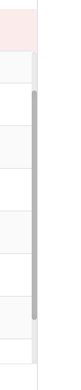

# Css修改滚动条样式

## 示例1
```css
/* 滚动槽 */
::-webkit-scrollbar {
    width: 6px;
    height: 6px;
}

::-webkit-scrollbar-track {
    border-radius: 3px;
    background: rgba(0, 0, 0, 0.06);
    -webkit-box-shadow: inset 0 0 5px rgba(0, 0, 0, 0.08);
}

/* 滚动条滑块 */
::-webkit-scrollbar-thumb {
    border-radius: 3px;
    background: rgba(0, 0, 0, 0.12);
    -webkit-box-shadow: inset 0 0 10px rgba(0, 0, 0, 0.2);
}
```

## 示例


## 示例2
```css
::-webkit-scrollbar {
  width: 6px
}

::-webkit-scrollbar:horizontal {
  height: 6px
}

::-webkit-scrollbar-track {
  border-radius: 10px
}

::-webkit-scrollbar-thumb {
  background-color: #0003;
  border-radius: 10px;
  transition: all .2s ease-in-out
}

::-webkit-scrollbar-thumb:hover {
  cursor: pointer;
  background-color: #0000004d
}
```

